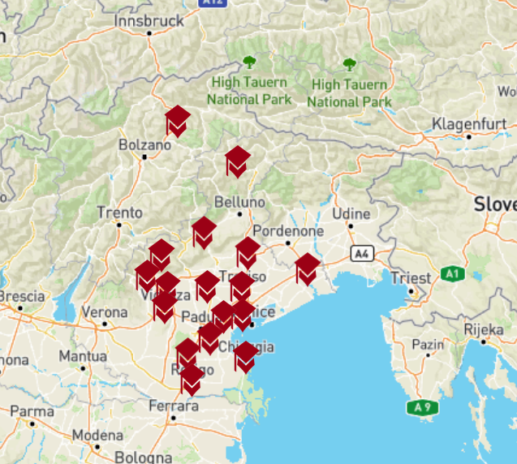
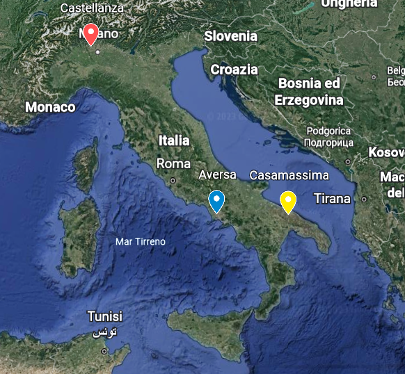

```{r setup, echo =FALSE}
library(knitr)

knitr::opts_chunk$set(echo = FALSE)
```

```{r, include = FALSE}
library(tinytex)
library(rmarkdown)
library(tidyverse)
library(factoextra)
library(ggplot2)
library(dendextend)
library(corrplot)
library(knitr)

df <- read.csv("data.csv")

#Only consider cities with a large enough number of students
df <- df[-1]#throw away original ID
rownames(df)<-t(df[1])
df <- df[-1]#throw away city name variable
df <- subset(df, total >= 1000, select = foreign_ratio:females_ratio)
```

## Dataset

-   The dataset refers to data about university students in Italy, grouped by the municipality of the university
-   This data can be retrieved from ISTAT, the Italian national institute of statistics
-   <http://dati.istat.it/>

## Concept

-   The idea is to cluster (some) cities according to composition of student body
-   Only 2 variables:
    -   Percentage of female students
    -   Percentage of foreign students
-   Original size: 2 variables, 270 observations

## Preliminaries

-   Why only 2 variables?
    -   No division between bachelor/master/PhD or age
-   Why "some" cities?
    -   Some municipalities have very few students, even less than 10 in some cases
    -   I considered cities with at least 1000 students
-   Why cities and not universities?
    -   Some cities have more than one university
    -   Some universities are in more than one city

## Preliminaries

{width="60%"}

## Preliminaries


## Purpose

-   As mentioned, the goal is to understand the composition of the student body in different cities
-   It could be useful, e.g., for students picking their exchange semester destinations

## Distance

-   As a first thing, check for correlation, to see what kind of distance metric to use

-   Also, plot points

    ```{r, echo = TRUE, include = TRUE}
    cor(df, use="complete.obs")
    ```

## 

```{r, echo = TRUE,figures-side, fig.show='hold', out.width="40%"}
plot(df)
plot(scale(df))
```

## Distance

-   As we have seen that there is no correlation, we can use the Euclidean distance

```{r, echo = TRUE}
distance <-dist(df, method = "euclidean")

fviz_dist(distance, show_labels = FALSE)

```

------------------------------------------------------------------------

## Clustering and dendrograms

-   Use the distance matrix to cluster

-   I used average, complete and single linkage

```{r, echo = TRUE}
single_linkage <- hclust(distance, method = "single")
complete_linkage <- hclust(distance, method = "complete")
average_linkage <- hclust(distance, method = "average")
```

------------------------------------------------------------------------

```{r, echo = FALSE, fig.show='hold'}
plot(single_linkage, labels = FALSE, main = "Single linkage")
plot(complete_linkage, labels = FALSE, main = "Complete linkage")
plot(average_linkage, labels = FALSE, main = "Average linkage")

```

## Correlations

-   Having the dendrogram, we can see if/how much they are correlated

```{r, echo = TRUE}
single_dend <- as.dendrogram(single_linkage)
complete_dend <- as.dendrogram(complete_linkage)
average_dend <- as.dendrogram(average_linkage)

dend_list <- dendlist("Single" = single_dend, "Complete" = complete_dend, "Average" = average_dend)
correlations <- cor.dendlist(dend_list)
```

------------------------------------------------------------------------

-   As we can see, there is a correlation but it is not statistically significant

```{r, echo = TRUE, include = TRUE}
testcorr <- cor.mtest(correlations, conf.level = 0.95, sig.level = -1)
corrplot(correlations, "pie", type = "lower", p.mat = testcorr$p , insig = 'p-value')
```

## Cutting trees

-   From the dendrograms, we can see where to cut the tree.

    -   Single linkage: height = 0.025

    -   Average and complete linkages: height = 0.075

```{r,echo=TRUE}
single_cut <- cutree(single_linkage, h = 0.025)
complete_cut <- cutree(complete_linkage, h = 0.075)
average_cut <- cutree(average_linkage, h = 0.075)

```

------------------------------------------------------------------------

```{r, echo=TRUE, warning =  FALSE, collapse = TRUE}
#Note that values on the axes are normalized
fviz_cluster(list(data = df, cluster = single_cut),
             labs(title = "Single Linkage"),
             ellipse.type = "convex",
             repel = TRUE, 
             show.clust.cent = FALSE, ggtheme = theme_minimal())+ggtitle("Single Linkage")

fviz_cluster(list(data = df, cluster = complete_cut),
             ellipse.type = "convex",
             repel = TRUE, 
             show.clust.cent = FALSE, ggtheme = theme_minimal())+ggtitle("Complete Linkage")

fviz_cluster(list(data = df, cluster = average_cut),
             ellipse.type = "convex", 
             repel = TRUE,
             show.clust.cent = FALSE, ggtheme = theme_minimal())+ggtitle("Average Linkage")

```

## Interpreting (some) results

-   There are some stable clusters

-   Some outliers on the right of the plot

-   But also 2 small clusters on the left (bottom and top)

## Stable cluster

-   Let us check one of them to see what is going on

-   Bottom left: Casamassima, Aversa, Castellanza

-   Low foreign ratio, low female ratio

-   Why?

## Stable cluster

-   One possible explanation: same type of university/departments

-   However: Casamassima, Castellanza have private business schools (LIUC, LUM respectively)

-   Aversa has an engineering department of a public university (UniCampania)

-   What about location?

## Stable cluster



## Conclusions

-   Dendrograms from different methods are correlated but not significantly

-   Cutting trees "visually" yields different results

-   There are quite a few outliers

-   But also a couple of small, stable clusters
